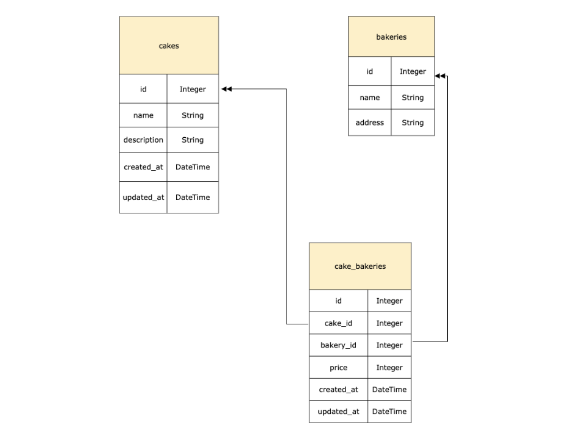

# Flask Mock Code Challenge

### For this code challenge we will be working with a Cake Bakery domain.  A Cake belongs to many bakeries through cake bakeries, a bakery has many cakes through cake bakeries, and a cake bakery belongs to a cake and to a bakery.  You will have to build out your models and routes and test your app using Postman.  Below is an entity diagram of the models.  
  




As for validations there must be a price and it must be at least 1 and no more than 1000.

You are to define the routes and the routes should return a response with the data in the specified format with the appropriate response code.  The routes are:

### GET "/bakeries"

```
    [
        {
            id:1,
            name:"Steve's Bakery",
            address: "101 Main Street"
        },
        {
            id:2,
            name:"Sam's Bakery",
            address:"101 Sky Street"
        },
        {
            id:3,
            name:"Tom's Bakery",
            address:"101 Blue Street"
        }
    ]

```

Get all bakeries.

### GET "/bakeries/:id"

```
    [
        {
            id:1,
            name:"Steve's Bakery",
            address: "101 Main Street",
            cakes:[
                {
                    id:5,
                    name:"chocolate cake",
                    description:"delicious chocolate cake"
                },
                {
                    id:5,
                    name:"vanilla cake",
                    description:"delicious vanilla cake"
                }
            ]
        }
    ]

```

Get the bakery with specified id.  If not found return error message with the appropriate response code.

### DELETE "/bakeries/:id

Delete the bakery with the specified id. If not found return an error message with the appropriate response code.  If successfully deleted return a response with an empty body with appropriate response code.

### GET "/cakes"

```
    cakes:[
                {
                    id:1,
                    name:"chocolate cake",
                    description:"delicious chocolate cake"
                },
                {
                    id:2,
                    name:"vanilla cake",
                    description:"delicious vanilla cake"
                },
                {
                    id:3,
                    name:"pound cake",
                    description:"delicious pound cake"
                }
            ]
```

Get all cakes.

### POST "cake_bakery"

Send a request with data in the following format to create a cake_bakery and save it to the database.

```
    {
        price:100,
        cake_id=1,
        bakery_id=2
    }
```

If cake_bakery is successfully created and saved to the database return a response with data pertaining to the cake that was added in the following format with the appropriate response code:

```
    {
        id:1,
        name:"chocolate cake",
        description:"delicious chocolate cake
    }
```

If not created successfully return a response with the error messages and appropriate response code.

**Make sure to *time* yourself, you should complete this practice code challenge within 90 minutes and save your work.  Good luck!!**
